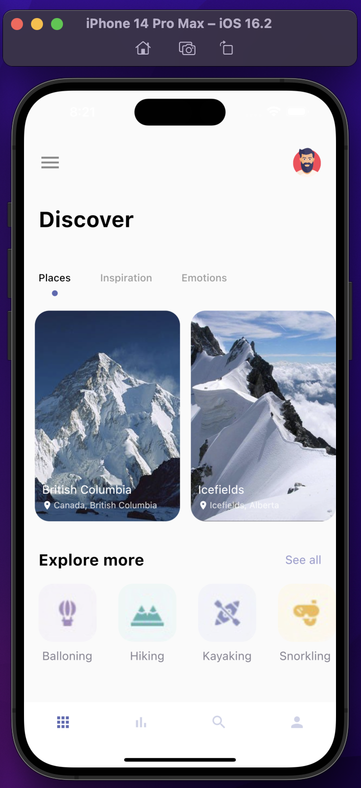
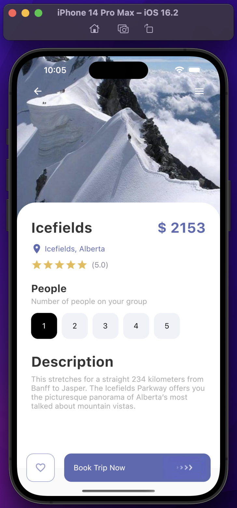
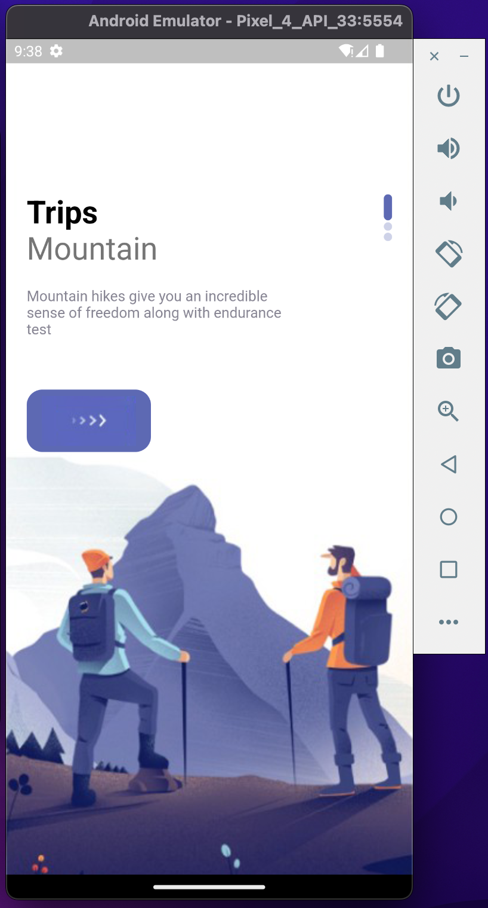
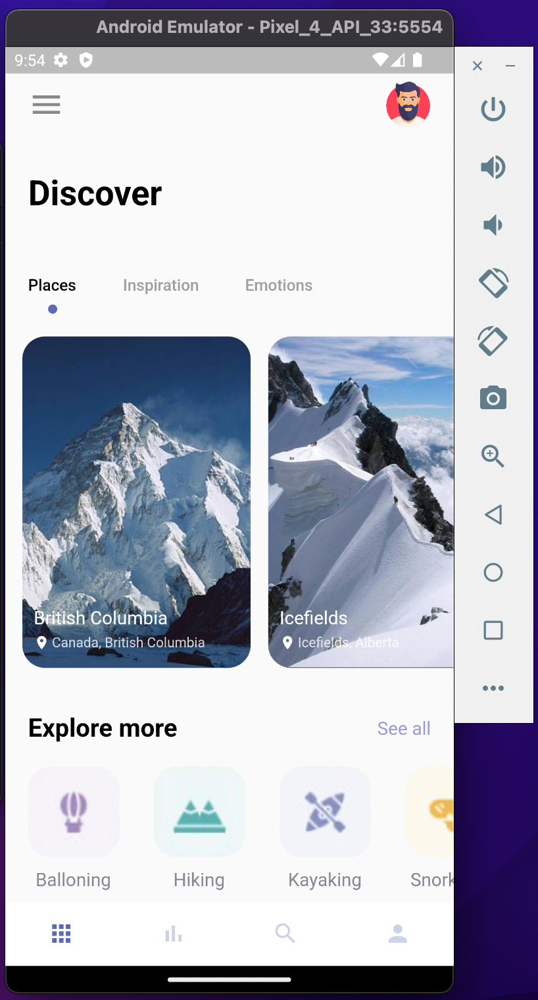
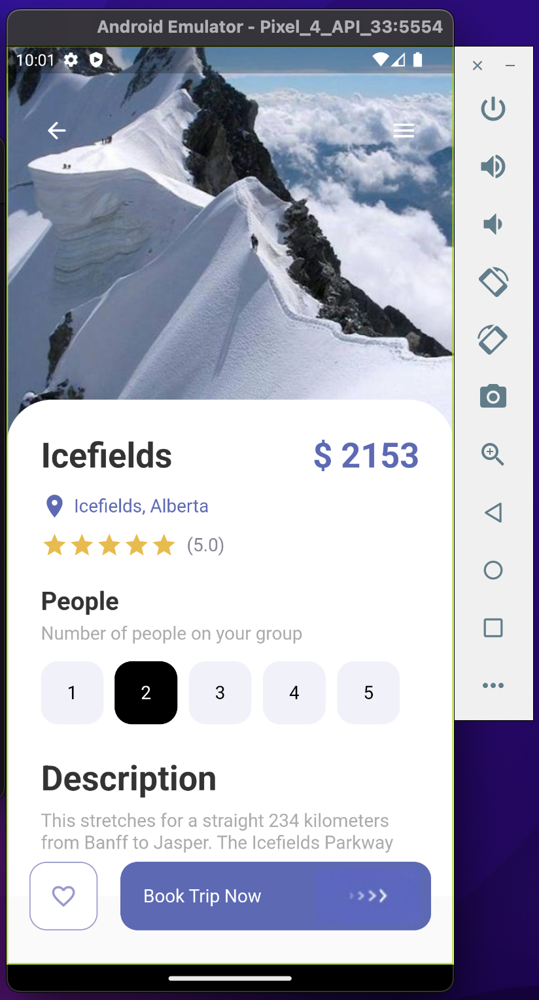

## Simple Travel App using Cubit


[](https://github.com/radensaleh/Simple-Travel-App-Cubit/blob/master/LICENSE)
[](https://flutter.dev/)
[](https://github.com/radensaleh/Simple-Travel-App-Cubit)

🔥 This is a simple Travel App built with Flutter framework

## Features
*  List Places
*  Detail Places

## 📸 Example iOS
<pre>
          
</pre>


## 📸 Example Android
<pre>
          
</pre>

## Modularization Structure 🔥

    # Root Project
    .
    ├── lib                    # Name of module (default from Flutter)
        ├── cubit              # Cubit state, Logics
        ├── misc               # Style (color static)
        ├── model              # Data Model
        ├── pages              # UI pages
        |   └── navpages       # Navigation Bar
        ├── services           # API Services
        └── widgets            # Custom widget which can be used repeatedly.

## Built With 🛠
* [BLoC Pattern (Cubit)](https://bloclibrary.dev/) - Business logic component to separate the business logic with UI.
* [Equatable](https://pub.dev/packages/equatable) - Being able to compare objects in `Dart` often involves having to override the `==` operator.
* [http](https://pub.dev/packages/http) - A composable, multi-platform, Future-based API for HTTP requests.
* [Animation](https://pub.dev/packages/show_up_animation) - A flutter package to simplify the implementation of "show up" animation.


## Author

* **Raden Saleh**

Don't forget to follow me, fork and give me a ⭐


## License

```
MIT License

Copyright (c) 2022 Raden Saleh

Permission is hereby granted, free of charge, to any person obtaining a copy
of this software and associated documentation files (the "Software"), to deal
in the Software without restriction, including without limitation the rights
to use, copy, modify, merge, publish, distribute, sublicense, and/or sell
copies of the Software, and to permit persons to whom the Software is
furnished to do so, subject to the following conditions:

The above copyright notice and this permission notice shall be included in all
copies or substantial portions of the Software.

THE SOFTWARE IS PROVIDED "AS IS", WITHOUT WARRANTY OF ANY KIND, EXPRESS OR
IMPLIED, INCLUDING BUT NOT LIMITED TO THE WARRANTIES OF MERCHANTABILITY,
FITNESS FOR A PARTICULAR PURPOSE AND NONINFRINGEMENT. IN NO EVENT SHALL THE
AUTHORS OR COPYRIGHT HOLDERS BE LIABLE FOR ANY CLAIM, DAMAGES OR OTHER
LIABILITY, WHETHER IN AN ACTION OF CONTRACT, TORT OR OTHERWISE, ARISING FROM,
OUT OF OR IN CONNECTION WITH THE SOFTWARE OR THE USE OR OTHER DEALINGS IN THE
SOFTWARE.
```